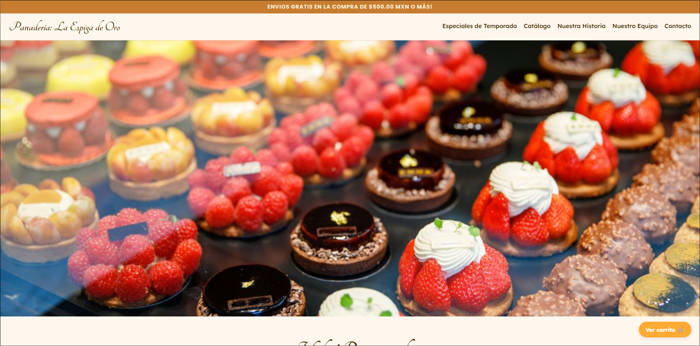
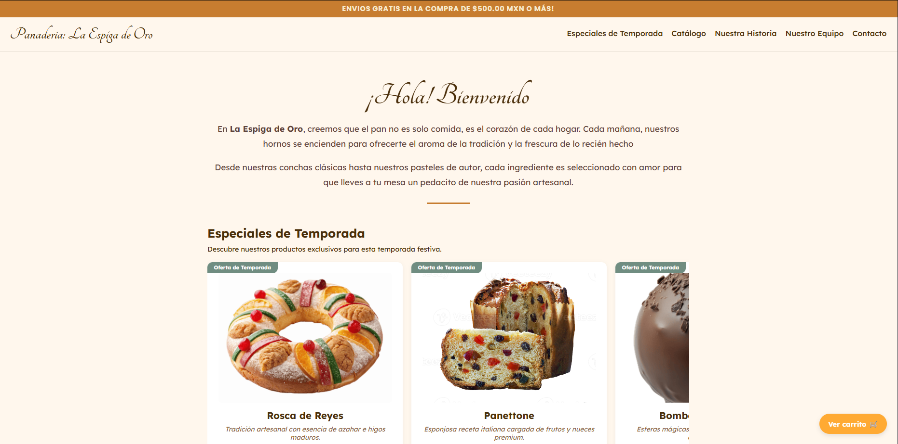
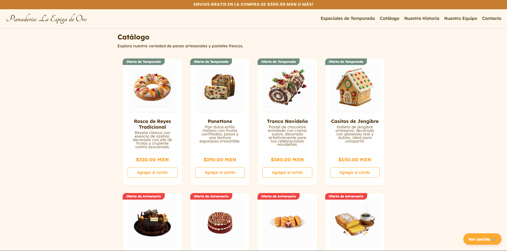
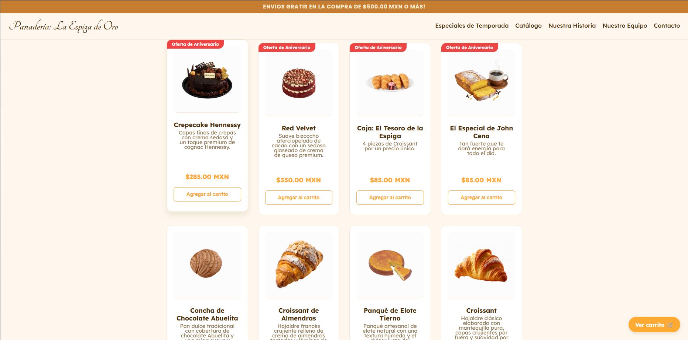
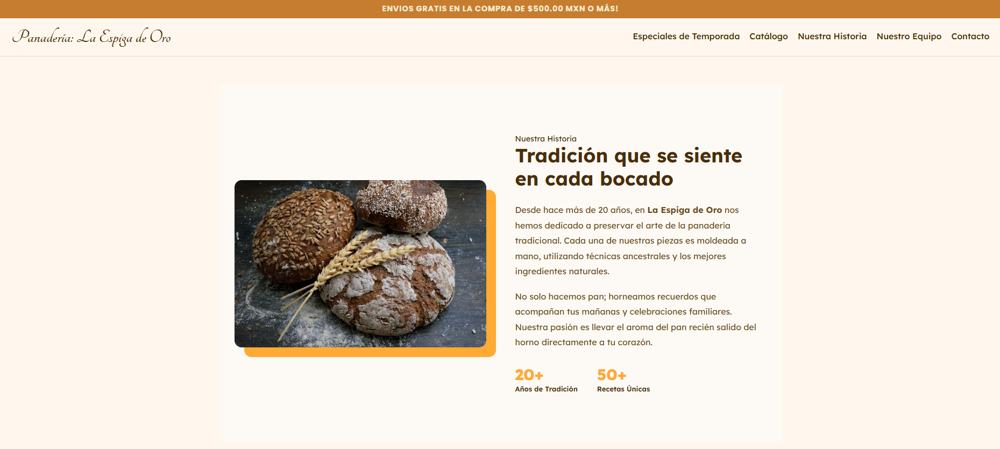
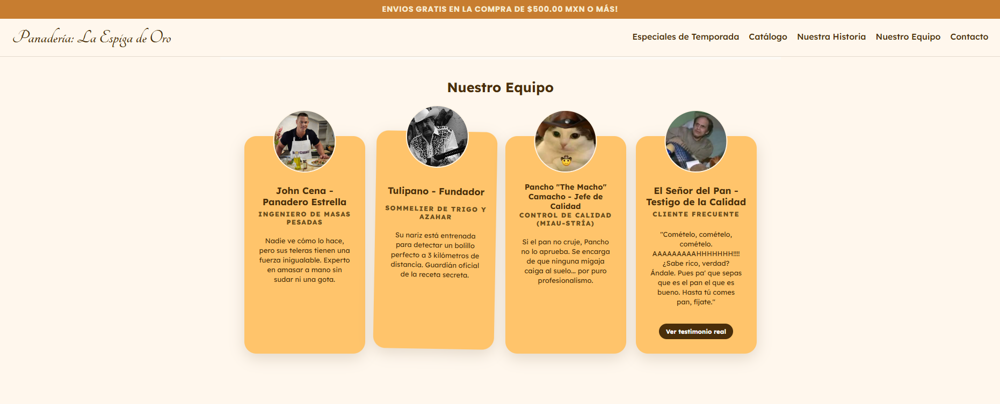
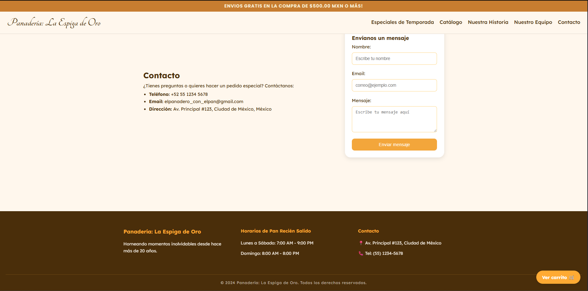

# 🥖 Panadería: La Espiga de Oro - Proyecto Final del Módulo 2

> **"Tradición artesanal con un toque de humor y diseño boutique."**

¡Bienvenido al repositorio de **La Espiga de Oro**! Este proyecto es un sitio web diseñado para una panadería que no solo se toma en serio la calidad de su pan, sino también la conexión con sus clientes a través de un diseño moderno y una personalidad divertida.

---

## 🍞 Objetivo del Proyecto

Construir una página web estática desde cero haciendo uso de:

- HTML semántico.
- Estilos aplicados mediante CSS.
- Organización visual a través de títulos, párrafos e imágenes.
- Enlaces internos y externos.
- Buenas prácticas de estructura.
- Manejo de Flexbox, Position y estilos aplicados mediante etiquetas y clases.
- Manejo del Diseño Responsivo para la adaptación en distintas pantallas de visualización.
- Uso de Git y GitHub para el control de versiones.
- Publicación del proyecto a través de GitHub Pages.

---

## 🥐 Panadería: La Espiga de Oro

Mi página web está basada en una **Panadería**, donde presento:
- Información de la panadería.
- Una barra de navegación.
- Un pie de página con información de la panadería.
- Secciones con enlaces internos, donde se presentan:
  - Especiales de Temporada.
  - Catálogo.
  - Nuestra Historia.
  - Nuestro Equipo.
  - Contacto.
- Formulario de contacto.
- Imágenes relevantes relacionadas a los productos.

---

## 📂 Estructura del Proyecto

El repositorio contiene:

```
├── index.html # Página principal del proyecto
├── style.css # Hoja de estilos del proyecto
├── /img # Carpeta principal de imágenes usadas durante el desarrollo del proyecto.
|  ├── /photos # Carpeta con un fotografías de panes, pasteles y productos.
|  └── /screenshots # Carpeta con capturas de pantalla de la visualización del proyecto.
└──README.md # Explicación del proyecto 
```
---

## 🔧 Tecnologías y Técnicas Utilizadas

- **HTML5**
- **CSS3** 
- **Git & GitHub**  
- **GitHub Pages**

* **Flexbox Layout**: Control total de alineación en el catálogo, equipo y contacto.
* **Responsive Design**: Adaptación de la página web a distintos tamaños de pantallas de visualización.
* **Posicionamiento Avanzado**: Uso de `position: absolute` para las fotos del equipo que sobresalen de las tarjetas.
* **Efectos Visuales**: 
    * `mix-blend-mode: multiply` para integrar imágenes con fondo blanco.
    * `margin-top: auto` para mantener los botones de compra siempre alineados al final de las tarjetas.
    * Transiciones suaves para una experiencia de usuario fluida.

---

## 🌐 Publicación

Mi proyecto está publicado en GitHub Pages y puedes verlo aquí:

👉 **URL del Proyecto:**  
https://ettijoseangel.github.io/Modulo2_Pagina_Web.github.io/

👉 **Repositorio en GitHub:**  
https://github.com/ettijoseangel/Modulo2_Pagina_Web.github.io

---

## 📝 Características Implementadas

- Uso correcto de `<html>`, `<head>`, `<body>`, `<title>`, `<meta>`
- Navegación interna con `<nav>` y `<a>`
- Secciones organizadas con `<header>`, `<main>`, `<section>`, `<article>` y `<footer>`
- Uso de títulos `<h1>`, `<h2>`, `<h3>`
- Imágenes de panes, pasteles y productos relacionados con una panadería.
- Uso de Flexbox, contenedores (Carrusel)
- Formulario con las etiquetas `<form>`, `<input>`, `<label>`
- Tarjetas con información de los productos disponibles.
- Estilos aplicados a través de una hoja de estilos en CSS.
- Versionado con Git (commits progresivos)

---

## 🖼️ Screenshots del proyecto realizado















---

## 👨🏻‍💻 Cómo visualizar el proyecto

1.  Clona este repositorio o descarga los archivos.
2.  Asegúrate de tener la carpeta de imágenes vinculada correctamente.
3.  Abre el archivo `index.html` en cualquier navegador moderno.

---

## 🚀 Despliegue en GitHub Pages

1. Para desplegar una página web, tenemos que asegurarnos de que el archivo principal sea **index.html**.  
2. Subimos el proyecto al repositorio en GitHub.  
3. En GitHub vamos a **Settings → Pages**.  
4. En **Build and Deployment**, seleccionamos:  
   - **Source:** Deploy from a branch  
   - **Branch:** main / root  
5. Guardamos los cambios.  
6. Esperamos unos segundos mientras se genera el sitio.  
7. Copiamos la URL pública que aparece en la sección de GitHub Pages.
